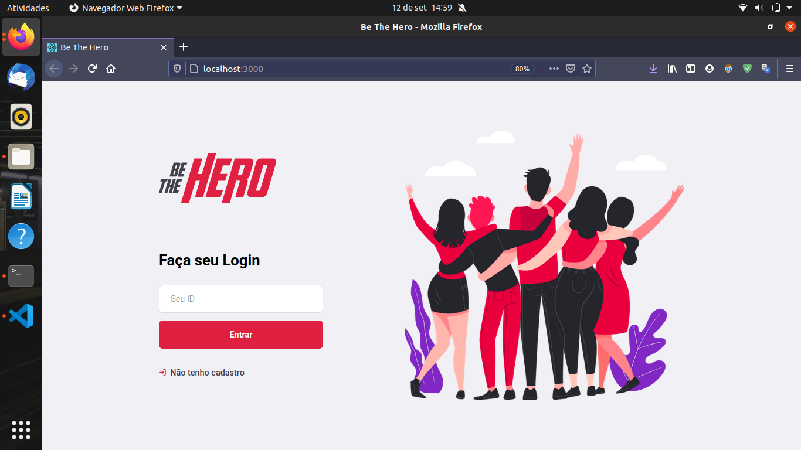
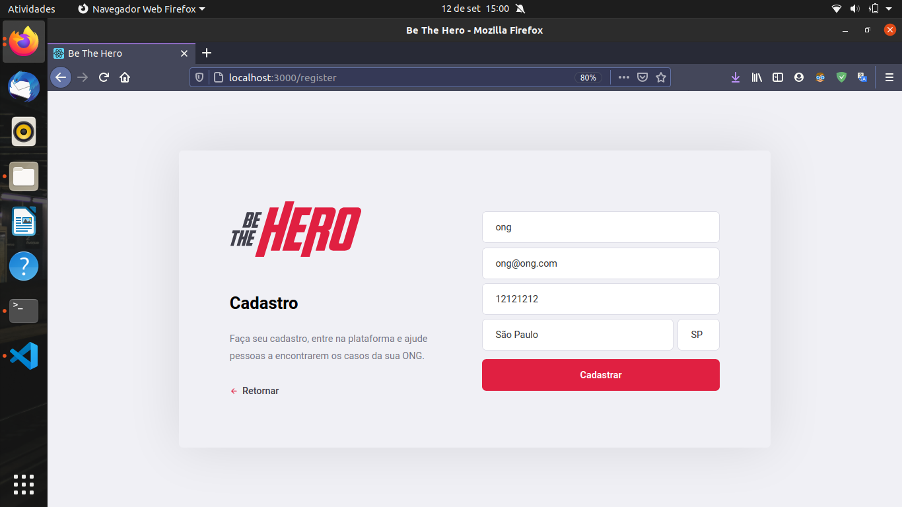
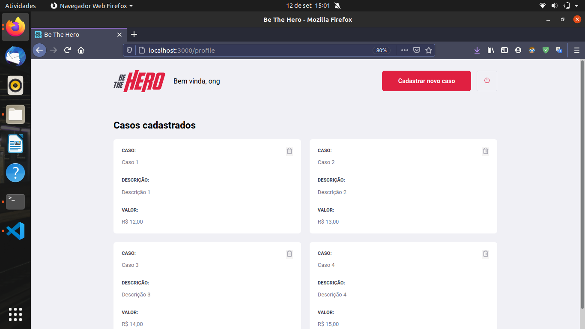
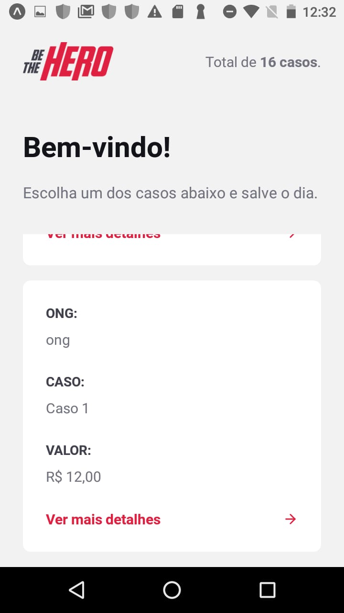
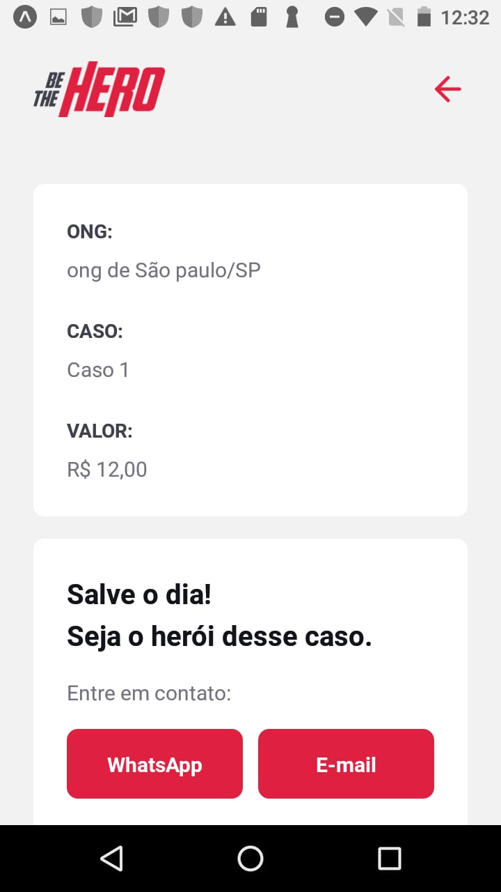

<h1 align="center">
    
</h1>


<h4 align="center"> 
	🚧  BeTheHero 1.0 :memo: Concluído 🚀 🚧
</h4>

<h4 align="center"> 
	🚧  BeTheHero - Trilha Extra :memo: Em andamento... 🚀 🚧
</h4>
<br><br>

## 💻 Sobre o projeto


:memo: BeTheHero - é uma forma de conectar pessoas que desejam fazer contribuições monetárias a ONG's. 

Projeto desenvolvido durante a **11º Semana Omnistack** oferecida pela [Rocketseat].


<br><br>


## ⚙️ Funcionalidades

- [x] As ONG interessadas podem se cadastrar na plataforma web enviando:
  - [x] Contato da ONG
  - [x] Nome da ONG
  - [x] Local
  - [x] Descrição

- [x] As ONG também podem cadastrar seus serviços enviando:
  - [x] Nome do Caso
  - [x] Valor
  - [x] Contato
  
- [x] Os usuários interessados podem:
  - [x] Encontrar os serviços.
  - [x] Fazer doação atráves dos contatos de Email ou WhatsApp


<br><br>

## 🎨 Layout

### Web

<p align="center">
  
  
  
</p>


<br><br>


### Mobile

<p align="center" style="display: flex; align-items: flex-start; justify-content: center;">
  
  
</p>


<br><br>


## 🚀 Como executar o projeto

Este projeto é divido em três partes:
1. Backend (pasta server) 
2. Frontend (pasta web)
3. Mobile (pasta mobile)

💡Tanto o Frontend quanto o Mobile precisam que o Backend esteja sendo executado para funcionar.

<br><br>


### Pré-requisitos

Antes de começar, você vai precisar ter instalado em sua máquina as seguintes ferramentas:
[Git](https://git-scm.com), [Node.js](https://nodejs.org/en/) e o gerenciador de pacotes [Yarn](https://yarnpkg.com).
Além disto é bom ter um editor para trabalhar com o código como [VSCode](https://code.visualstudio.com/)


<br><br>


#### 🎲 Rodando o Backend (servidor)

```bash

# Clone este repositório
$ git clone https://github.com/savio-2-lopes/Be-The-Hero.git

# Acesse a pasta do projeto no terminal/cmd
$ cd Be-The-Hero

# Vá para a pasta backend
$ cd backend

# Instale as dependências
$ yarn add

# Execute a aplicação em modo de desenvolvimento
$ yarn start

# O servidor inciará na porta:3333 - acesse http://localhost:3333 

```

#### 🧭 Rodando a aplicação web (Frontend)

```bash

# Clone este repositório
$ git clone https://github.com/savio-2-lopes/Be-The-Hero.git

# Acesse a pasta do projeto no terminal/cmd
$ cd Be-The-Hero

# Vá para a pasta da aplicação Front End
$ cd frontend

# Instale as dependências
$ yarn add

# Execute a aplicação em modo de desenvolvimento
$ yarn start

# A aplicação será aberta na porta:3000 - acesse http://localhost:3000

```

<br><br>


## 🛠 Tecnologias

As seguintes ferramentas foram usadas na construção do projeto:

- [Node.js](https://nodejs.org/en/)
- [React](https://reactjs.org)
- [React Native](https://facebook.github.io/react-native/)
- [Expo](https://expo.io/)


<br><br>

## 🦸 Autor

<a href="https://github.com/savio-2-lopes">
 
 <br>
 <sub><b>    Savio Lopes </b></sub></a> <a href="https://github.com/savio-2-lopes" title="Github">  🚀</a>
 <br><br>
 
 
[](https://www.linkedin.com/in/savio-lopes/) 
[](https://github.com/savio-2-lopes)
[](https://api.whatsapp.com/send?phone=12996798894&text=Hello!)
[](mailto:savioaugulopes@gmail.com)


Feito com ❤️ por Savio Lopes 👋🏽 [Entre em contato!](https://www.linkedin.com/in/savio-lopes/)

